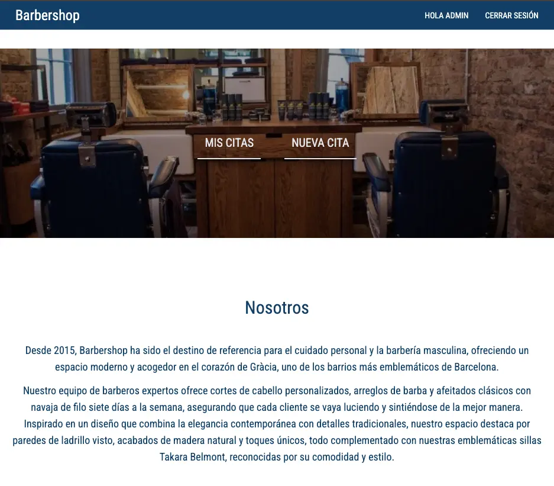
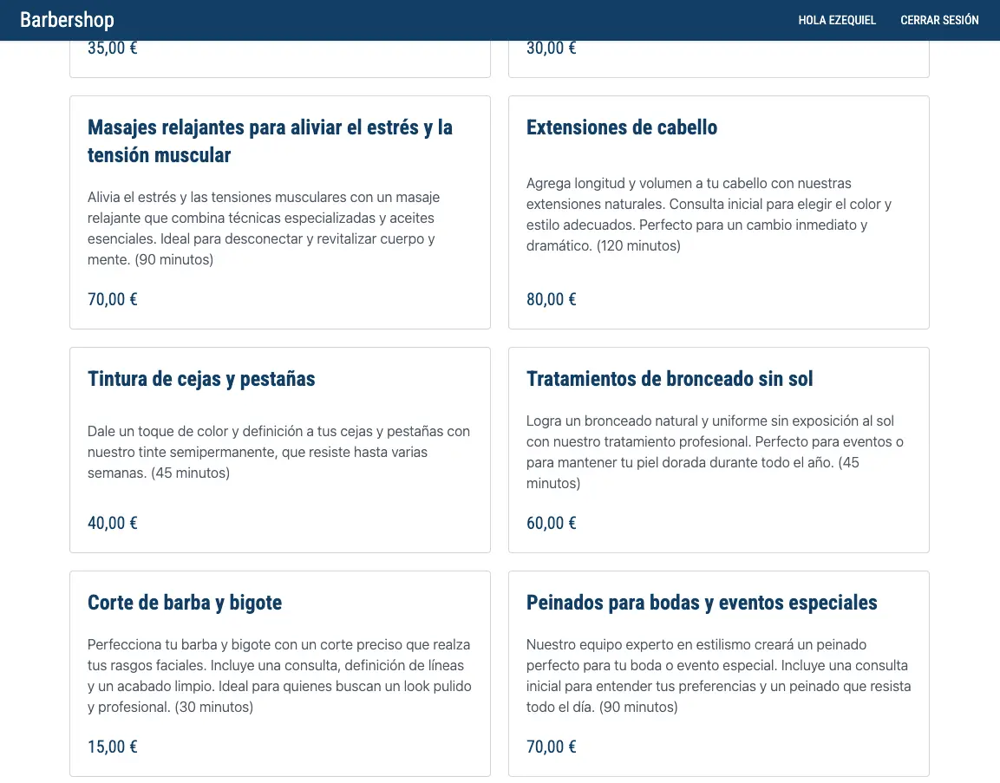

# Barbershop — Aplicación MEVN


## 📄 Descripción

**Barbershop** es una aplicación web desarrollada con el stack **MEVN** (MongoDB, Express, Vue.js, Node.js), pensada para la gestión de una barbería. Permite a los usuarios autenticarse, reservar turnos y consultar servicios de forma intuitiva, todo desde una interfaz moderna y adaptada a dispositivos móviles.


---

## 🌐 Demo

🔗 [barbershop-mevn.vercel.app](https://barbershop-mevn.vercel.app)

---

## 🖼️ Capturas




---


## ✨ Funcionalidades

### 🔹 Frontend

- **Autenticación de usuarios:**
  - Registro e inicio de sesión con manejo de tokens JWT.
  - Vista dinámica según el estado de autenticación (botón "Iniciar Sesión", saludo personalizado, etc.).

- **Visualización de servicios:**
  - Servicios cargados dinámicamente desde la base de datos usando **Pinia** y **Axios**.
  - Diseño responsivo en cuadrícula con nombre, descripción, precio e icono.

- **Gestión de turnos:**
  - Reserva, visualización y cancelación de citas.
  - Redirección automática si el usuario no está autenticado.

- **Navegación condicional:**
  - Invitados: solo botón “Reservar Ahora”.
  - Usuarios autenticados: acceso a "Mis Citas" y "Nueva Cita".

- **Estilo moderno:**
  - Estilizado con **Tailwind CSS** y diseño mobile-first personalizado.

---

### 🔹 Backend

- **Autenticación segura:**
  - Autenticación con **JSON Web Tokens (JWT)**.
  - Middleware de protección para rutas privadas.

- **API de Servicios:**
  - Endpoints REST para obtener servicios desde MongoDB.
  - Pensado para ser escalable y fácil de extender (alta/baja/modificación de servicios).

- **API de Turnos:**
  - Gestión completa de citas: crear, ver, cancelar.
  - Envío de correos a usuarios y administradores (con Nodemailer).

- **API de Usuarios:**
  - Registro, login y edición de perfil.
  - Validación personalizada de contraseñas seguras.

- **Manejo de errores:**
  - Middleware global de errores.
  - Validaciones consistentes y respuestas claras.

- **Base de datos:**
  - **MongoDB Atlas** como sistema de almacenamiento principal.
  - Esquemas diseñados para rendimiento y escalabilidad.

- **Variables de entorno:**
  - Conexión a MongoDB, claves JWT, configuración de envío de emails, frontend URL.

---

## 💻 Tecnologías Utilizadas

### Frontend
- **Vue.js**
- **Pinia**
- **Axios**
- **Tailwind CSS**

### Backend
- **Node.js**
- **Express**
- **MongoDB + Mongoose**
- **JSON Web Tokens (JWT)**
- **Nodemailer**

---

## 📋 Requisitos

- **Node.js**: v16 o superior
- **MongoDB Atlas**: o instancia local
- **Cuenta SMTP (Mailtrap u otra)**

---


## 🧱 Estructura del Proyecto

```bash
Barbershop/
├── backend/                    # Backend Express + MongoDB
│   ├── config/                 # Configuración de DB y servicios
│   ├── controllers/            # Lógica de negocio por módulo
│   ├── data/                   # Datos precargados, catálogos o fixtures
│   ├── emails/                 # Plantillas y lógica para emails
│   ├── handlers/               # Validaciones, errores y utilidades del request
│   ├── middlewares/           # Autenticación y validaciones
│   ├── models/                 # Esquemas de Mongoose
│   ├── routes/                 # Definición de endpoints
│   ├── utils/                  # Funciones auxiliares reutilizables
│   ├── index.js                # Entrada principal del servidor
│   └── ...
├── frontend/                   # Frontend Vue 3 + Vite
│   ├── src/
│   │   ├── assets/             # Imágenes y recursos estáticos
│   │   ├── components/         # Componentes reutilizables
│   │   ├── views/              # Vistas de páginas
│   │   ├── stores/             # Estado global con Pinia
│   │   ├── router/             # Definición de rutas frontend
│   │   ├── helpers/            # Funciones auxiliares (formato, validación, etc.)
│   │   └── main.js             # Punto de arranque de la app
│   ├── public/                 # Recursos públicos
│   ├── .env.local              # Variables de entorno para Vite
│   └── vite.config.js          # Configuración de Vite
├── README.md
└── .gitignore


```
---

## 🛠️ Instalación

```bash
git clone https://github.com/eze-ms/Barbershop.git

```
---

© 2024. Proyecto desarrollado por Ezequiel Macchi Seoane
